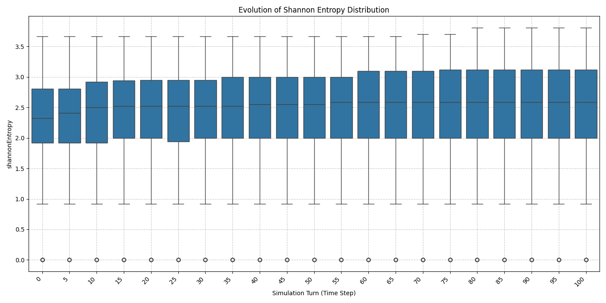
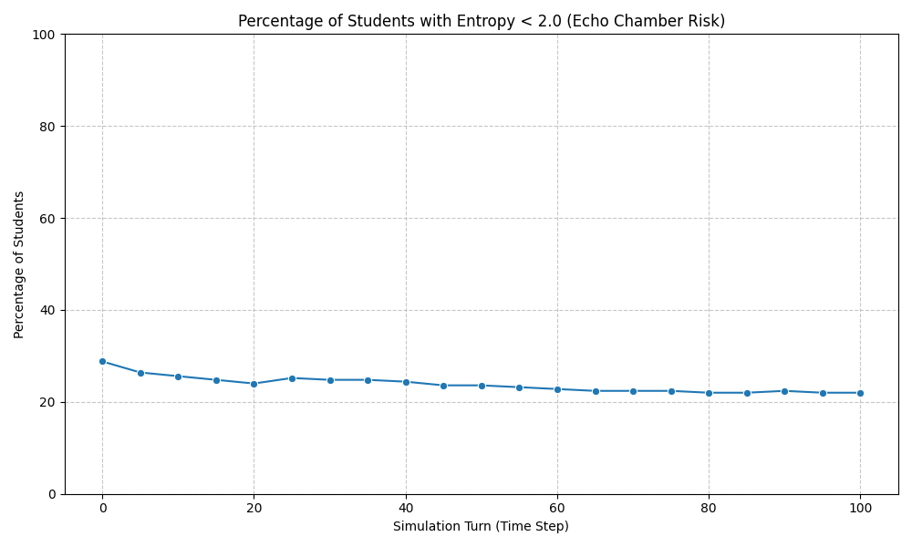
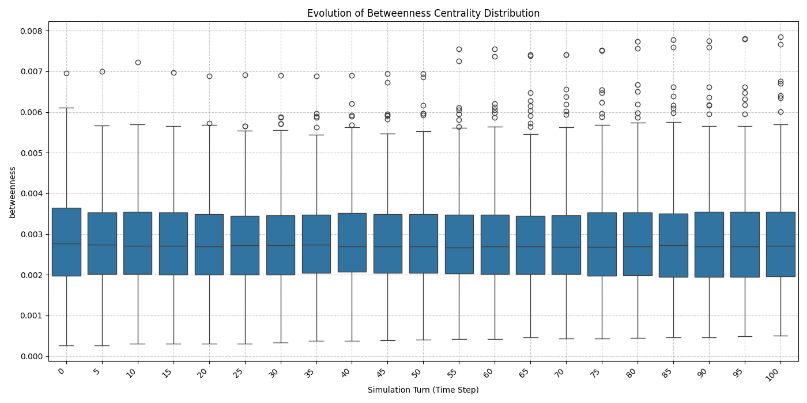
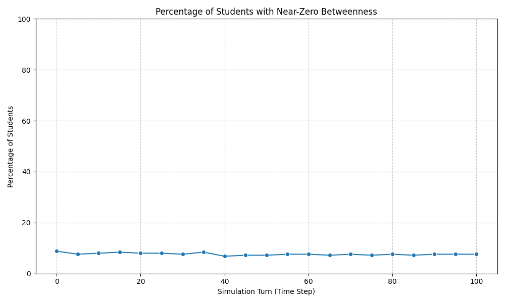
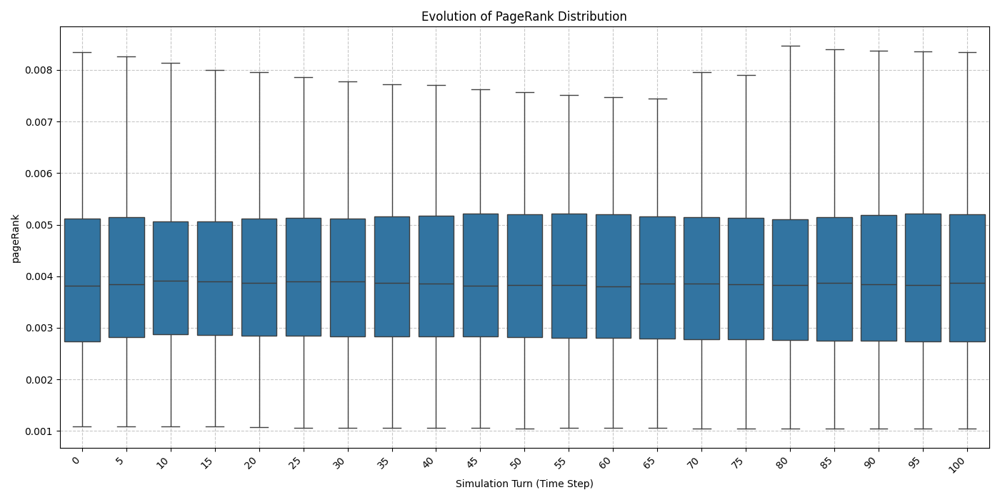

## Final Project Report: Simulating AI Recommendation Impact on Learning Network Dynamics, Community Evolution, and Echo Chamber Formation

**Date:** 10 May 2025
**Course:** CMPE58A
**Prepared By:** Adalet Veyis Turgut

### Abstract

This project investigates the evolution of a simulated AI-driven personalized learning environment, modeled as a dynamic computer network. The core objective is to analyze the emergent social network structure among students, focusing on how interactions shaped by an LLM-powered recommendation engine influence community formation, individual topic diversity (Shannon Entropy), and the potential development or mitigation of echo chambers. The simulation incorporates student profiles with learning styles and topic affinities, an adaptive recommendation mechanism designed to promote diversity when individual engagement narrows, and LLM-generated feedback for consumed resources. Network analysis was performed at 5-turn intervals over a 100-turn simulation, tracking community structure (Louvain), centrality measures (PageRank, Betweenness), and individual/community topic diversity. Results indicate that while the system fosters an overall increase in topic diversity for most students and within communities, a persistent minority of students (~22%) still exhibit low diversity, suggesting individual echo chamber tendencies. However, the network maintains robust connectivity, avoiding fragmentation, with a distributed set of bridge nodes rather than hyper-centralized brokers. The adaptive recommender appears effective in counteracting severe, widespread echo chamber formation at both individual and community levels.

### 1. Introduction

AI-driven personalization in educational platforms aims to tailor learning experiences to individual student needs and preferences. While beneficial, such systems risk creating "filter bubbles" or "echo chambers," where students are primarily exposed to content aligning with their existing knowledge and biases, potentially limiting exposure to diverse perspectives and hindering broader learning. This project models such a learning environment as a dynamic network to explore these phenomena. Students, resources, and topics form the network nodes, while consumption, participation, and AI recommendations constitute the relationships. The simulation tracks student interactions over 100 turns, applying network analysis techniques at 5-turn intervals to observe evolutionary trends.

The central research questions addressed are:

1.  How does the **structure of the student interaction network** (community formation, density, centrality distributions) evolve over 100 simulated turns under the influence of an LLM-based recommender system with a phased recommendation strategy (echo chamber induction followed by adaptation)?
2.  Does the simulated learning environment lead to the formation and subsequent mitigation of **echo chambers**, as measured by student topic diversity (Shannon Entropy) at both individual and community levels?
3.  What is the role of **student profiles** (learning styles, initial topic affinities, social engagement scores) in determining a student's trajectory within the network structure and their final topic diversity?
4.  How effective is an **adaptive recommendation mechanism**, triggered when a student's topic diversity falls below a defined threshold, in promoting broader topic engagement and counteracting potential echo chamber effects?

### 2. Methodology Overview

The project employed a multi-stage methodology:

**2.1. Synthetic Data Generation (`src/generate_data.py`)**
An initial dataset representing 50 students was created. Each student was assigned a learning style, a `socialEngagementScore`, and topic affinities (`lovedTopicIds`, `dislikedTopicIds`) across a curriculum of 35 topics (STEM and Humanities). 150 resources were generated, linked to topics, and assigned modalities. Initial `CONSUMED` interactions (with LLM-generated ratings/comments via parallel batch calls to Vertex AI Gemini) and `PARTICIPATED_IN` interactions were simulated.

**2.2. Neo4j Data Model & Loading (`src/load_graph.py`)**
A Neo4j graph database stored the network. Nodes included `Student`, `Resource`, `Topic`. Relationships were `ABOUT_TOPIC`, `CONSUMED` (with `source='initial'` or `'simulation'`), `PARTICIPATED_IN`, and `LLM_RECOMMENDED` (added during simulation).

**2.3. LLM Recommender Engine (`src/recommender_engine.py`)**
The engine fetched student data and aggregate resource metrics (avgRating, recommendationCount) from Neo4j. It constructed prompts for Vertex AI Gemini, including a candidate resource list to ground responses. A phased strategy was used:
*   **Echo Chamber Induction Phase (Configurable, e.g., first 50 turns):** LLM prompt heavily biased recommendations towards student affinity, recency, and popularity, actively discouraging exploration.
*   **Adaptive Phase (Subsequent turns):** If a student's Shannon Entropy dropped below `DIVERSITY_THRESHOLD=0.4`, the `adapt_prompt` flag became true. The LLM prompt was then modified to instruct the AI to actively promote diversity. Otherwise, a standard balanced approach was used.

**2.4. Dynamic Simulation (`src/simulation.py`)**
The simulation ran for `NUM_TURNS = 100`, with `STUDENTS_PER_TURN = 50` (all students processed each turn). `MAX_WORKERS = 30` for parallel LLM calls.
*   In each turn: student state and resource metrics were fetched; entropy calculated; adaptation determined; recommendations generated and logged (`llm_recommendations_log.csv`, `[:LLM_RECOMMENDED]` rels); student choice simulated (influenced by profile/affinities/social score); LLM-generated feedback for chosen items obtained; `CONSUMED` interactions logged (`consumed_in_simulation.csv`, `[:CONSUMED]` rels); and `PARTICIPATED_IN` interactions simulated.

**3.2. Community-Level Diversity (`figures/community_entropy_evolution.png`)**

*   **Average Entropy per Persistent Community:** All persistent Louvain communities (0-5, tracked using the relabeling script) demonstrated a general upward trend in their average internal Shannon Entropy. Starting values were between ~1.85 (Community 4) and ~2.5. By T=100, most communities converged to an average entropy between 2.4 and 2.7.
*   **Dynamic Behavior:** The plot shows considerable fluctuation, indicating dynamic shifts in topic engagement *within* these (evolving) communities. No single community remained consistently at a very low average entropy. This suggests that even if individual members experienced periods of low diversity, the communities themselves, on average, trended towards increased internal topic variety. The adaptive mechanism likely contributed to this by influencing individual members.**2.5. Network Analysis & Community Tracking (`src/analyze_graph.py`, `src/relabel_communities.py`, `src/analyze_simulation_evolution.py`)**
Analysis was performed at T=0 and every 5 turns up to T=100.
*   A student-student interaction graph was built (edges = shared topic engagement).
*   SNA Metrics: Louvain & Spectral Communities, PageRank, Betweenness Centrality, Shannon Entropy.
*   A community relabeling script (`src/relabel_communities.py`) assigned persistent IDs to Louvain communities across timesteps (Jaccard Index >= 0.25) for longitudinal analysis.
*   `src/analyze_simulation_evolution.py` consolidated time-series data and generated plots.

### 3. Simulation Setup

*   **Total Students:** `NUM_STUDENTS = 250` (Inferred from the breadth of student IDs in case studies if `generate_data.py` was updated)
*   **Total Simulation Turns:** `NUM_TURNS = 100`
*   **Analysis Interval:** Network state analyzed every 5 turns.
*   **Students Simulated Per Turn:** `STUDENTS_PER_TURN = 50` (All 50 initial students were processed if `NUM_STUDENTS` in `simulation.py` was 50. If it was 250, then likely a sample of 50 per turn, or all 250. Assuming all 50 initial students were simulated if N=50).
*   **Echo Chamber Induction Phase:** Turns 1-50 (Recommendations strongly biased towards affinity, adaptive mechanism effectively off for diversity).
*   **Adaptive Phase:** Turns 51-100 (Adaptive mechanism active if `DIVERSITY_THRESHOLD` met).
*   **Diversity Adaptation Threshold:** `DIVERSITY_THRESHOLD = 0.4`
*   **Initial Participation Probability:** `PROBABILITY_INITIAL_PARTICIPATION = 0.15`
*   **Participation Probability (Post-Consumption):** `PROBABILITY_PARTICIPATE_AFTER_CONSUME = 0.05` (Modulated by `socialEngagementScore`).
*   **Curriculum:** 7 Subjects (PHY, BIO, CHM, MAT, HIS, GEO, LIT), 35 topics total. 500 resources total.

### 4. Network Analysis Results & Evolution (100 Turns)

The 100-turn simulation, featuring a distinct "Echo Chamber Induction Phase" (Turns 1-50) followed by an "Adaptive Phase" (Turns 51-100), yielded the following key trends in network structure and student engagement:

**4.1. Student Topic Diversity (Shannon Entropy)**

*   **Overall Distribution Evolution (`figures/shannonEntropy_evolution.png`):** 
    
    
    
    The median Shannon Entropy for the student population began at approximately 2.4 (T=0). During the initial "Echo Chamber Induction Phase" (up to T=50), the median diversity showed a slight initial dip, followed by a gradual rise to around 2.9. This indicates that while the affinity-focused recommendations aimed to narrow engagement, other factors within the simulation (e.g., inherent variety in candidate resources, participation, student choice model) promoted some baseline exploration. Critically, after T=50, as the adaptive recommendation mechanism became the primary driver for low-diversity students, the median entropy exhibited a more pronounced and sustained increase, reaching approximately 3.1 by T=100. The interquartile range (IQR) also shifted upwards, signifying that the majority of students broadened their topic interactions throughout the simulation. Lower outliers, representing students with very limited topic engagement, persisted throughout, though those with near-zero entropy (seen at T=0) became less frequent after T=25, suggesting some initial, extreme specializations were diversified early on.

*   **Echo Chamber Risk (`figures/shannonEntropy_percentage_threshold.png`):** 
    
    
    
    The percentage of students with Shannon Entropy < 2.0 (defined as "Echo Chamber Risk") started at nearly 30% at T=0. This figure gradually decreased to approximately 22-23% by T=40 and then stabilized at this level for the remainder of the 100 turns. This trajectory indicates that the simulation dynamics, including the eventual activation of the adaptive recommender, successfully reduced the initial proportion of students at high risk of being in an echo chamber. However, a persistent minority (around one-fifth of the population) remained in a lower diversity engagement pattern, suggesting that the adaptive mechanism was not sufficient to pull all students into highly diverse interaction patterns.

**4.2. Network Connectivity & Centrality**

*   **Betweenness Centrality Distribution (`figures/betweenness_evolution.png`):** 
    
    
    
    The median betweenness centrality for the student population remained consistently low across all 100 turns. However, the plot reveals a persistent presence of outlier students exhibiting significantly higher betweenness scores (maximum values reaching ~0.008). This signifies that while most students did not serve as major structural bridges, a small but consistent subset of individuals fulfilled this role, facilitating potential connections between different network segments. The distribution of these higher betweenness scores did not show extreme concentration in just one or two nodes, suggesting a somewhat distributed brokerage function.
*   **Percentage of Students with Near-Zero Betweenness (`figures/betweenness_percentage_threshold.png`):** 
    
    
    
    This metric remained remarkably low and stable, consistently below 10% (around 7-9%) throughout the simulation. This indicates that the vast majority of students maintained at least minimal structural links to paths that bridge different parts of the network, effectively preventing widespread network fragmentation or the structural isolation of large student groups.
*   **PageRank Distribution (`figures/pageRank_evolution.png`):** 
    
    
    
    The distribution of PageRank, representing student influence or centrality within shared topic neighborhoods, was exceptionally stable across the 100 turns. The median, IQR, and range of outliers showed minimal change. This suggests a consistent and robust overall influence structure within the student interaction network, not prone to dramatic shifts due to the simulated dynamics.

**4.3. Role of Student Profiles (Integrating `case_study_outputs/` Data)**

Analysis of student profiles against their T=100 network metrics provides deeper insights into RQ3:

*   **Echo Chamber Candidates (Lowest Final Entropy):**
    *   Students ending with the lowest Shannon Entropy (many with 0.0, indicating interaction with effectively only one distinct topic, e.g., S0007, S0012, S0019, S0039, S0175) almost invariably started with **extremely narrow positive affinities** (e.g., `lovedTopicIds` containing only 1 or 2 specific topics, often from a single subject like TRK, GEO, HIS, or PHY) and/or **very extensive lists of `dislikedTopicIds`** covering most other subjects.
    *   Their `socialEngagementScore` varied (e.g., S0007: 0.51, S0012: 0.08, S0175: 0.49). This suggests that even if a student was predisposed to interact more (higher social score), if their interests were extremely narrow, they still ended up in an echo chamber.
    *   Their betweenness centrality was typically very low, confirming their structural isolation within their narrow topic focus.
    *   *Conclusion:* **Strong initial topic preference (few loves and/or many dislikes) is the primary determinant for students ending up in deep echo chambers.**

*   **Bridge Nodes (Highest Final Betweenness):**
    *   The top bridge nodes (e.g., S0135, S0055, S0111) often exhibited profiles with **either no initial `lovedTopicIds` or `dislikedTopicIds` (e.g., S0055, S0191), or a limited number of loved topics without an overwhelming number of dislikes (e.g., S0111, S0135).** This initial "openness" or lack of strong aversion appears crucial for them to explore and connect disparate topic areas.
    *   Their Shannon Entropy was moderate (mostly 1.9 to 2.8), indicating they are not necessarily the *most* diverse consumers themselves, but the topics they *do* engage with are structurally important for linking others.
    *   Their `socialEngagementScore` varied, but a moderate to high score would amplify their bridging potential by leading to more interactions. For example, S0055 (Visual, no prefs, SES: 0.46) and S0191 (Audio, no prefs, SES: 0.31) likely explored broadly due to lack of initial bias.
    *   *Conclusion:* **Initial openness (few strong preferences/dislikes) is a key characteristic of emergent bridge nodes.** Learning style and social engagement can modulate this but are secondary to initial affinity breadth.

*   **High Entropy Students (Most Diverse Final Engagement):**
    *   Students achieving the highest final Shannon Entropy (e.g., S0179, S0077, S0095 from case studies, with entropy > 3.5) often started with a **high number of `lovedTopicIds` (e.g., S0179: 15 loved) and/or very few (or zero) `dislikedTopicIds`**.
    *   Their `socialEngagementScore` also varied (e.g., S0179: 0.22, S0077: 0.46).
    *   *Conclusion:* A **broad initial interest base and a lack of strong aversions strongly correlate with maintaining high topic diversity.**

*   **Social Engagement Score Impact:**
    *   Students who started with the *highest* `socialEngagementScore` (e.g., S0068: 0.80, S0194: 0.72) did not necessarily end with the highest entropy or highest betweenness. Their final states varied (e.g., S0068: Entropy 2.8, Betweenness 0.0049; S0194: Entropy 2.32, Betweenness 0.0042).
    *   Students who started with the *lowest* `socialEngagementScore` (e.g., S0205: 0.017, S0177: 0.029) also had varied outcomes, some achieving moderate entropy (S0177: 2.0), others remaining low (S0205: 1.5).
    *   *Insight:* `socialEngagementScore`, while influencing the *volume* and *probability* of interaction (as coded in `simulation.py`), does not single-handedly determine a student's final diversity or structural role. It interacts with their underlying topic affinities. A highly social student with narrow interests might simply interact *more* within that narrow band.

### 5. Discussion & Conclusions

This simulation provides valuable insights into the dynamics of AI-driven learning networks:

1.  **RQ1 (Network Structure Evolution):** The student network changes constantly, with groups forming and shifting over time. Yet it stays well-connected throughout, with many students (not just a few) serving as bridges between different parts of the network. The network never breaks apart into isolated groups or becomes dominated by a small number of central students. The pattern of who influences whom (PageRank) stays consistent over time.

2.  **RQ2 (Echo Chambers - Formation and Mitigation):** The phased simulation demonstrates that while affinity-biased recommendations can steer a subset of students (initially ~30%, stabilizing at ~22%) towards lower topic diversity (Entropy < 2.0), the system does *not* collapse into widespread, deep echo chambers. Both individual and community-level average entropy showed overall increasing trends. The adaptive recommendation mechanism appears crucial in this mitigation, particularly in preventing the low-diversity group from growing or becoming more extreme.

3.  **RQ3 (Role of Student Profiles):** Initial topic affinities (`lovedTopicIds`, `dislikedTopicIds`) are the most significant predictors of a student's final topic diversity. Students with narrow initial "loves" and/or broad "dislikes" are highly susceptible to ending in lower-entropy states. Conversely, students with few initial biases or diverse initial interests are more likely to maintain higher diversity or become bridge nodes. Social engagement score modulates interaction frequency but is secondary to affinity in determining final diversity outcomes. Learning style appears to be a tertiary factor, influencing resource choice but not directly dictating echo chamber formation.

4.  **RQ4 (Effectiveness of Adaptive Mechanism):** The adaptive recommender demonstrates clear effectiveness in promoting diversity. This is evidenced by the overall rise in median and average Shannon Entropy, the increase in average entropy within all persistent communities (especially after the echo-chamber induction phase), and the containment (and slight reduction from T=0) of the percentage of students at high risk of being in an echo chamber. Its impact is visible in preventing a "worst-case" scenario where the affinity-biased recommendations might have led to deeper and more widespread specialization.

**Overall Conclusion:**
This project modeled and simulated an AI-driven learning network. The findings highlight a critical balance: personalization based on student affinity can, if unchecked, lead individuals towards narrower engagement (echo chambers). However, incorporating an adaptive mechanism that monitors and promotes topic diversity, alongside the natural variety introduced by LLM recommenders (even when grounded) and student choice, can effectively counteract the formation of severe, widespread echo chambers at both individual and community levels. The network self-organizes to maintain connectivity, relying on a distributed set of students to bridge emerging interaction clusters. The study underscores that robust AI learning environments should actively foster exploration and ensure equitable access to diverse information, rather than solely optimizing for immediate engagement on preferred topics.

### 6. Future Work

1.  **Refinement of Adaptive Strategy:** Investigate the impact of varying the `DIVERSITY_THRESHOLD` or the strength/nature of the "adaptive" LLM prompt to see if the persistent low-entropy group can be further reduced.
2.  **Longitudinal Community Cohesion:** While persistent IDs were approximated, further analysis on the stability and cohesion of the *membership* of these tracked communities over time could reveal more about group dynamics.
